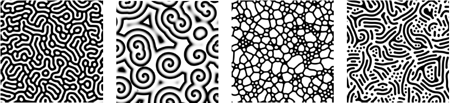

# Reaction Diffusion - The project

A simulation of two virtual chemicals reacting and diffusing on a 2D grid can be created, and depending on some parameters, the simulation generates patterns that are beautiful to see like the ones below:

Our program randomly chooses theses parameters and simulates the reaction, at the end of it, the program verifies if the reaction was successful, if it wasn't the parameters used are saved and the process is repeated. Lastly the simulation is uploaded to youtube.

This program its created by me and my friend <a href="https://github.com/ThiagoMaxPavao" target="_blank">Thiago Pavão</a> 

This inspiration and credits come over from: <a href="http://karlsims.com/rd.html" target="_blank">karlsims</a>   

This result from application, is posted on youtube: <a href="https://www.youtube.com/channel/UCLPilamtxru5X251Iy0D6HQ/featured" target="_blank">Project Reaction Diffusion</a> 
